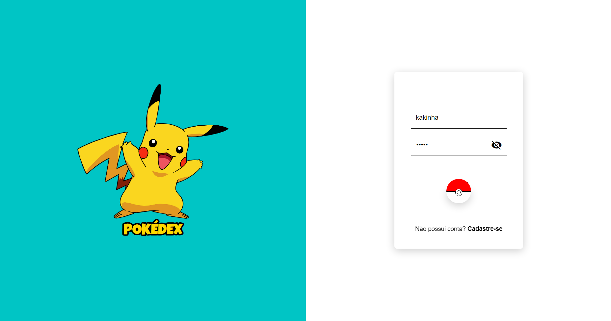
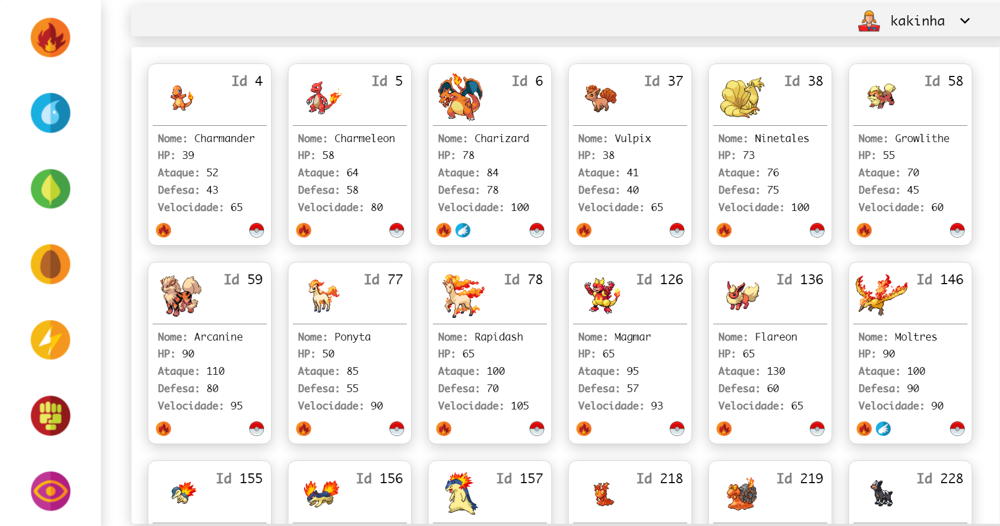

# Pokédex Pokemon

## Descrição

Pokédex Pokemon é um projeto que foi desenvolvido para o meu crescimento de conhecimento em Angular

## 🛠 Tecnologias Usadas

* Angular: Angular é uma plataforma e framework para construção da interface de aplicações usando HTML, CSS e, principalmente, JavaScript, criada pelos desenvolvedores da Google. Neste projeto de estudo foquei em aplicar componentização;

## Imagem da Aplicação
<h1 align="center">
  
</h1>
<h1 align="center">
  
</h1>